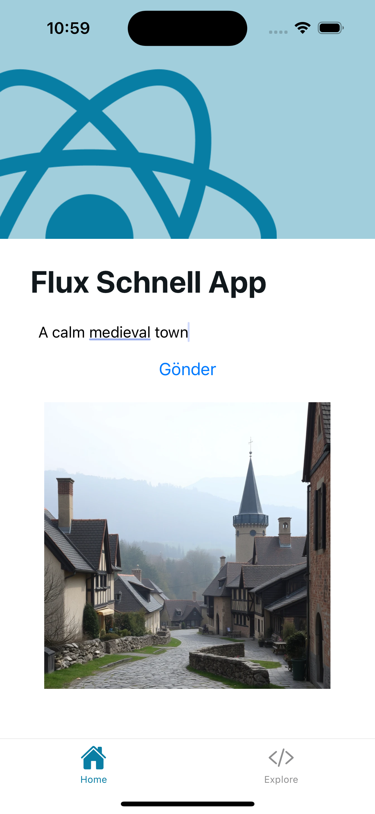

# example-expo-replicate

Template for a simple Expo React Native project structure for running AI models with [Replicate](https://replicate.com), specifically [Flux-Schnell](https://replicate.com/black-forest-labs/flux-schnell) for image generation.

This is an [Expo](https://expo.dev) project created with [`create-expo-app`](https://www.npmjs.com/package/create-expo-app).

